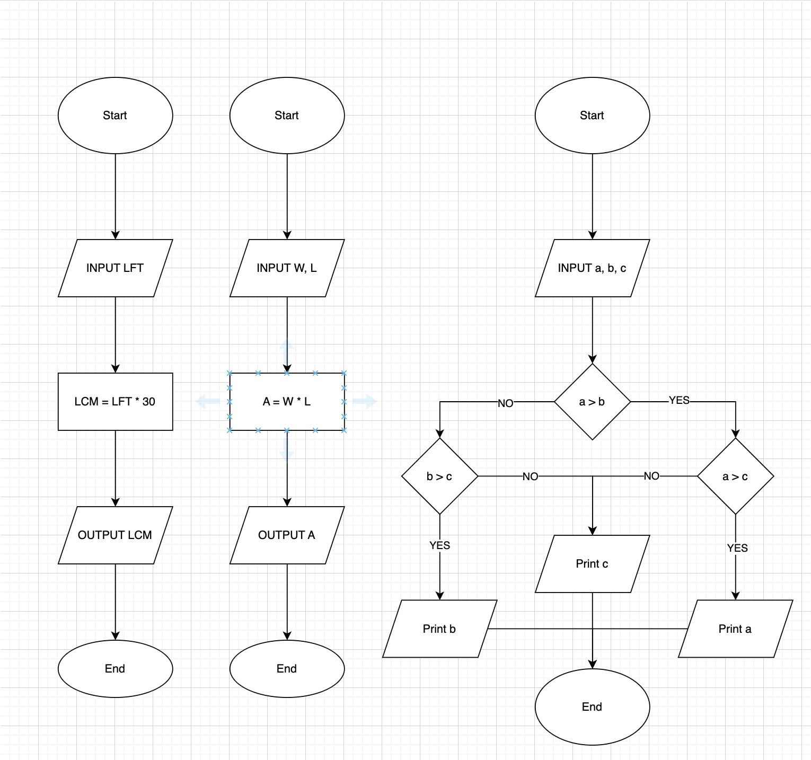
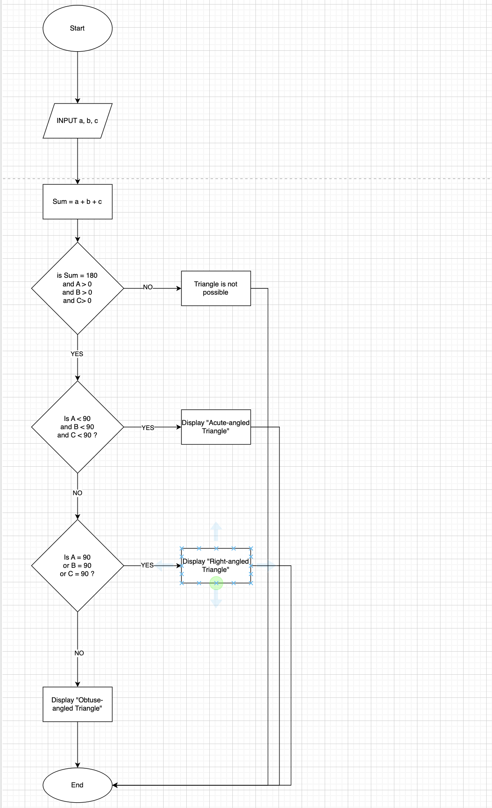
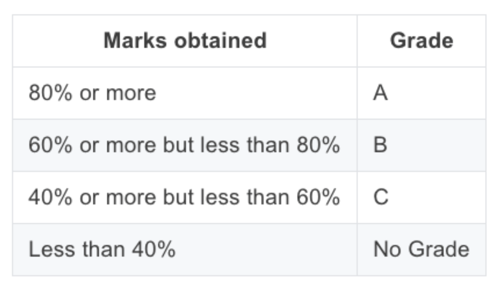
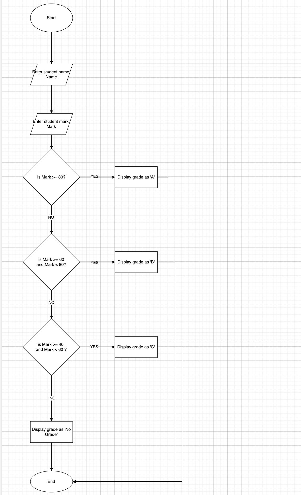

# Flow Chart Exercises:
- Write an algorithm and draw a flowchart to convert the length in feet to centimeters.

-  Write an algorithm and draw a flowchart that will read the two sides of a rectangle and calculate its area.

- Write an algorithm and flowchart that reads three numbers and prints the value of the largest number.

- Write an algorithm and flowchart to check three number inputs whether a triangle is possible or not.

- Draw the flowchart for the following:

- Accept the name and marks obtained by a student in Computer Project. Display the grades as per the table given below

