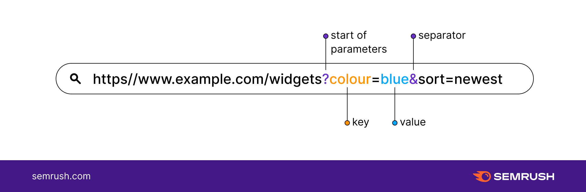
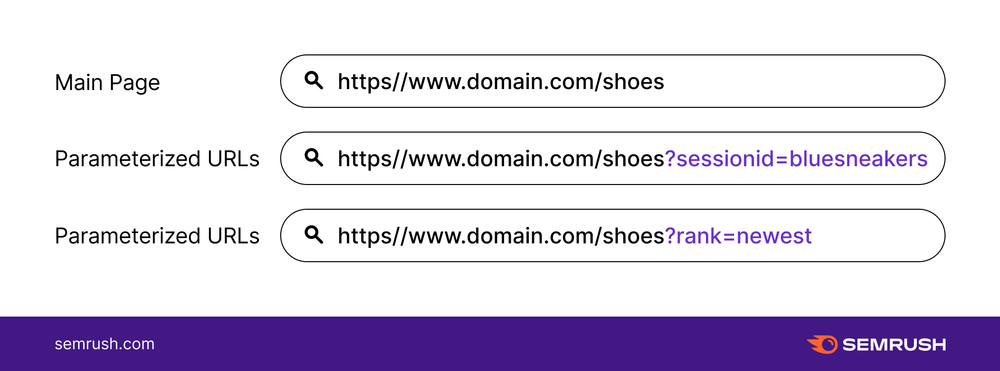
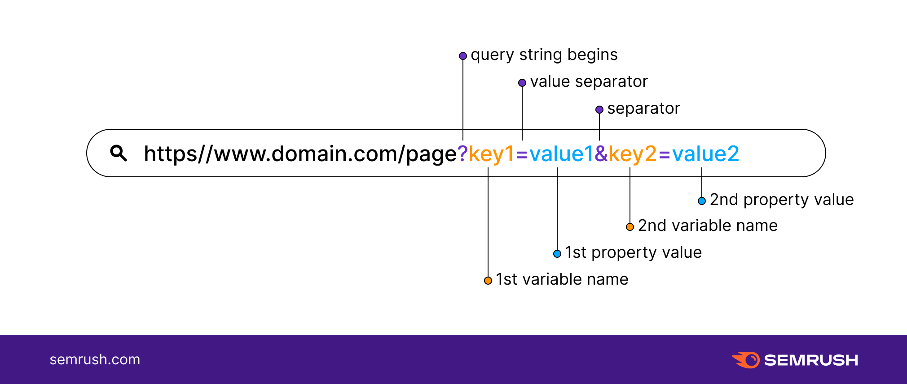

`Query Parameters`: Query parameters are additional values that are added to the end of a URL, separated by a question mark (?) and an ampersand (&) if there are multiple parameters. They are used to pass data to the server, typically for filtering or searching purposes. For example, in the URL "https://example.com/search?q=yoga&category=fitness", "q" and "category" are query parameters that pass the search term "yoga" and filter by the "fitness" category.

`Slug`: A slug is a short label for something, containing only letters, numbers, underscores or hyphens. They’re generally used in URLs. For example, the slug for this page is "query-params".
